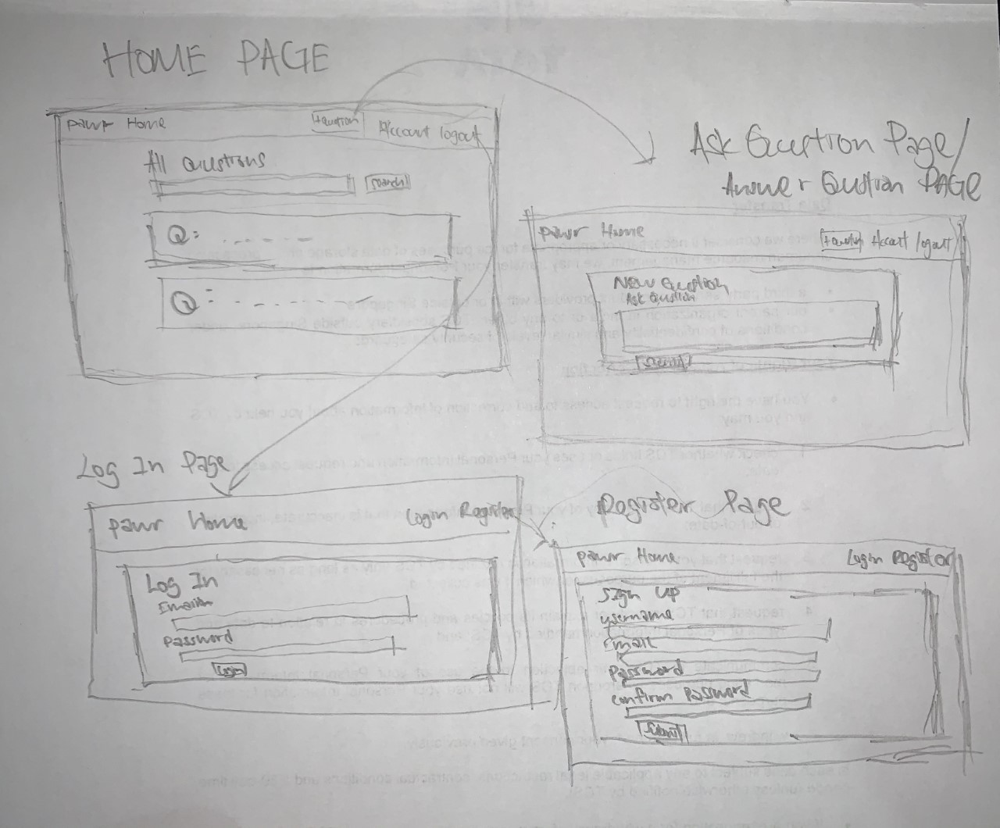

# pawr
A website for pet users and enthusiasts to share and gain knowledge . 
Project deployed on Heroku can be viewed on [pawr.herokuapp.com](https://pawr.herokuapp.com/).

## Project purpose
I was inspired to do this project when i was searching the internet for some answers on my pet cat. I couldnt really find a website where i can ask a question and get answers directly.
So i thought that it would be a good idea to create one so that users can ask questions and get answers from the community(similar to Quora, but for pets). 

This project features CRUD (create, read, update, delete) functions on questions and answers and also user authentication, so only authors can update, delete their posts. 
It is built with Python and Flask, MongoDB as the database, and a bit of HTML, CSS, JavaScript, Boostrap 4 for the frontend. 

## Project Strategy and Scope
### User stories
- User would like post questions about their pets . Feature to implement: an easy to spot button to post their questions so they do not have to look for the search button.

- User would like to answer questions . Feature to implement: 'Answer' button to be placed within question block so users can answer directly after reading the question.

- User would like to be able to search for questions to see if their questions have already been answered. Feature to implement: A 'search function' directly above all the questions so users can search before posting their questions.

- User would like to view the answers and also know how many times a question have been answered. Feature to implement: 'Answers' can be viewed directly below a question and shown how many answers are available. If no answers available, will be shown to user that no answers are available and will ask if they would like to answer the question.

- User would like to visit a 'no-frills' webpage which is easy to navigate. Features to implement: Simple UI design where all buttons are visible to allow users a seamless user experience. 

## Project Structure 
Users will have to sign up for an account before they can submit questions and answers. However, non registered users can still view questions and answers. If they want to answer or ask a question, they will be redirected to the log in page. If they do not have an account, they can click on register to register for an account and log in.
Once logged in, they can start to post questions and answers .

### Wireframe

### Project Skeleton
#### Existing Features
- User authentication system
- create, read, update, delete questions and answers
- search questions by words inside a question

#### Features to implement in the future
- Users to be able to private message each other for help 
- Author of question to be able to select the answer best suited to their question
- Users to be able to comment/upvote/downvote on an answer to show other users if the answers are effective
- Able to show best answer with a different background color so that users will not have to scroll through all the answers. 
- Integrate a lost and found app for users to post their lost pets or found ones . 
- Users to be able to search by type of animals 
- Pagination of questions . 

## Project Surface
### Design
- Using vibrant earthy colors(brown, yellow) for animal/nature feel, 
- Questions and answers easily readable with bold font
- Datetime posted, answered shown using code to humanize datetime objects to be more readable. 
- Delete button in red to let users know that they are deleting their post. 

## Technologies Used 
- HTML5 used for markup language
- Jinja2 used for templating language
- Bootstrap 4, CSS3 used to style webpage
- Jquery used for manipulation of DOM elements
- Heroku used for deployment of webpage to the internet 
- MongoDB used for database of project
- Python and Flask used for backend and web framework
- Google Fonts for brand font
- Github used for version control
- Gitpod used as online IDE 

## Testing
Tested responsiveness on [https://amiresponsive.blogspot.com/](https://amiresponsive.blogspot.com/)

This website was tested across multiple device screen sizes available in Developer tools(google chrome).
website scales accordingly across different screen sizes. 

I also tested the website manually on

Mobile devices:
Iphone XS max,
Iphone 11 Pro Max, 
Ipad Pro,
Ipad mini,
Samsung A70,
Samsung S20+, 

Computers:
Acer Predator 15inch Google Chrome,
Apple MacBook Pro 13inch Safari, 
Windows Desktop 32inch display Google Chrome, 

All links and buttons work as intended, no bugs found when i tested on all the devices listed above. 

## Deployment 
This app is deployed on Heroku

These are the steps i took to deploy the website:

1. In Bash(main project directory), type in 

        heroku login
        
1. Log into the heroku with credentials of heroku account
1. In Bash, create a new app (replace <app_name> with a name of your own. must be unique). 

        heroku create <app_name>
        
1. Check that new remotes are added with the following in Bash:

        git remote -v
        
1. Install gunicorn by typing the following in the Bash. 

        pip3 install gunicorn

1. Create a name file named "Procfile" (without the quotes, and the first P must be uppercase) type the following in Bash:

        touch Procfile
        
        
1. Open Procfile in the editor and add the following line to it, and save. Replace <your python file name without the .py> with the name of the file that holds the Flask app.
        
        
        web gunicorn <your python file name without .py>:app 
        
        
1. In Bash, create requirements file with the following code:
        
        
        pip3 freeze --local > requirements.txt

1. In bash, commit everything: 
        
        
        git add .
        git commit -m "<Your Commit Message>"
        git push
 
 
1. In bash, push to heroku using:

        git push heroku master

1. We have environment variables in our .env file that we will want to add into Heroku as well.

- To set a config variable, use:

        heroku config:set WHATEVER=VALUE

- So for our case, to set the MONGO_URI:

        heroku config:set MONGO_URI= mongodb+srv://root:asd1234..........y
        
- and for the SECRET_KEY:

        
        heroku config:set SECRET_KEY= .....................................

- To check all the config variables you have, use:

        heroku config

Your website is now deployed! check for website url in the output after push to heroku succeeded. 

## Credits and Acknowledgements

- Code to humanize datetime taken from [Here](https://shubhamjain.co/til/how-to-render-human-readable-time-in-jinja/)
- Refactoring of code to packages, WT-forms and user authentication following tutorial from [Corey Schafer's Flask Tutorial](https://www.youtube.com/watch?v=MwZwr5Tvyxo&list=PL-osiE80TeTs4UjLw5MM6OjgkjFeUxCYH)  
